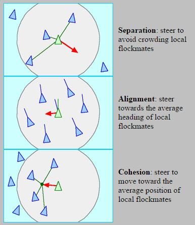

# Boid Simulation

**Autori**: Notarpietro Sabrina, Pivi Riccardo, Schirripa Mattia  
**Data**: Giugno 2024  

## Descrizione del progetto

Questo progetto implementa una simulazione bidimensionale del volo di stormi basata sull'algoritmo di Craig Reynolds del 1986. I "boids" (dall'inglese "bird-oid objects") sono oggetti la cui interazione segue 3 leggi (vedi figura), creando un comportamento emergente: lo stormo. La simulazione include una visualizzazione grafica dei "boids" utilizzando la libreria SFML.



Per maggiori informazioni sul progetto,
consultare [la relazione](Relazione_di_Programmazione_Boid_Simulation_1__Anno_DIFA_UNIBO.pdf) riguandante il codice ed i risultati della simulazione reperibile in questa repository.

### Tecnologie utilizzate
- **Linguaggio**: C++
- **Framework di visualizzazione**: [SFML](https://www.sfml-dev.org/)
- **Sistema di Build**: [CMake](https://cmake.org/)

## Struttura del progetto

Il progetto è organizzato nei seguenti file:

- **Codice Sorgente**
  - `main.cpp`: Inizializzazione della simulazione e gestione dell'input utente.
  - `birds.cpp`, `twodimensional.cpp`, `trianglesfml.cpp`: Contengono le definizioni delle classi e delle funzioni.
  - Header files: `birds.hpp`, `twodimensional.hpp`, `trianglesfml.hpp`.

- **Test**
  - `test.cpp`: Contiene i test per verificare la correttezza delle funzioni principali utilizzando il framework Doctest.

- **File di configurazione**
  - `.clangformat`: Per la formattazione del codice.
  - `CMakeLists.txt`: File di configurazione per la compilazione con CMake.

## Compilazione ed Esecuzione

### Requisiti
- **CMake** 3.16 o superiore
- **SFML** 2.5 o superiore

# Istruzioni di Compilazione ed Esecuzione con CMake

Per compilare ed eseguire il progetto, segui questi passaggi:


 1. Configura il progetto e genera i file di build
```bash
cmake -S . -B build -DCMAKE_BUILD_TYPE=Release
```
 2. Compila il progetto
```bash
cmake --build build
```
 3. Spostati nella directory di build
```bash
cd build
```
 4. Esegui il file generato
```bash
./boids
```
# Risultati Grafici

